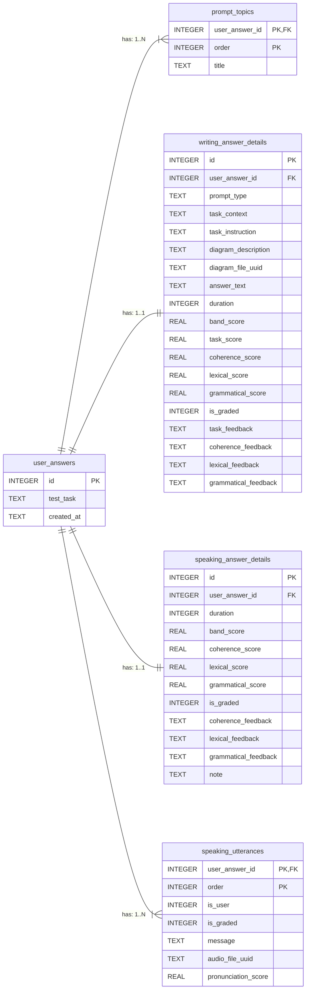

# ER Diagram

```mermaid
erDiagram
    direction LR
    user_answers ||--|{ prompt_topics : "has: 1..N"
    user_answers ||--|| writing_answer_details : "has: 1..1"
    user_answers ||--|| speaking_answer_details : "has: 1..1"
    user_answers ||--|{ speaking_utterances : "has: 1..N"

    user_answers {
        INTEGER id PK
        TEXT test_task
        TEXT created_at
    }

    prompt_topics {
        INTEGER user_answer_id PK,FK
        INTEGER order PK
        TEXT title 
    }

    writing_answer_details {
        INTEGER id PK
        INTEGER user_answer_id FK
        TEXT prompt_type
        TEXT task_context
        TEXT task_instruction
        TEXT diagram_description
        TEXT diagram_file_uuid
        TEXT answer_text
        INTEGER duration
        REAL band_score
        REAL task_score
        REAL coherence_score
        REAL lexical_score
        REAL grammatical_score
        INTEGER is_graded
        TEXT task_feedback
        TEXT coherence_feedback
        TEXT lexical_feedback
        TEXT grammatical_feedback
    }

    speaking_answer_details {
        INTEGER id PK
        INTEGER user_answer_id FK
        INTEGER duration
        REAL band_score
        REAL coherence_score
        REAL lexical_score
        REAL grammatical_score
        INTEGER is_graded
        TEXT coherence_feedback
        TEXT lexical_feedback
        TEXT grammatical_feedback 
        TEXT note
    }

    speaking_utterances {
        INTEGER user_answer_id PK,FK
        INTEGER order PK
        INTEGER is_user
        INTEGER is_graded
        TEXT message
        TEXT audio_file_uuid
        REAL pronunciation_score
    }
```