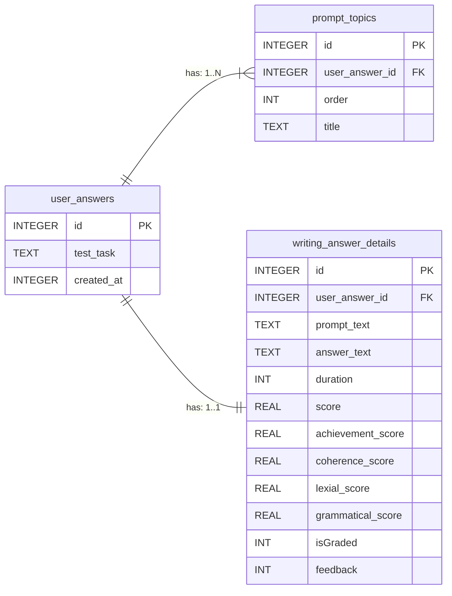

# ER Diagram

```mermaid
erDiagram
    direction LR
    user_answers ||--|{ prompt_topics : "has: 1..N"
    user_answers ||--|| writing_answer_details : "has: 1..1"

    user_answers {
        INTEGER id PK
        TEXT test_task
        INTEGER created_at
    }

    prompt_topics {
        INTEGER id PK
        INTEGER user_answer_id FK
        INT order
        TEXT title 
    }

    writing_answer_details {
        INTEGER id PK
        INTEGER user_answer_id FK
        TEXT prompt_text
        TEXT answer_text
        INT duration
        REAL score
        REAL achievement_score
        REAL coherence_score
        REAL lexial_score
        REAL grammatical_score
        INT isGraded
        INT feedback
    }
```